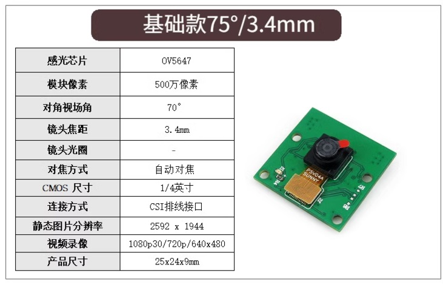

# 树莓派 -相机

- 树莓派 5 最多可以连接 2 个 CSI 相机

## 接口

### csi接口

- **CSI接口**
一般指 Camera Serial Interface，即相机串行接口，是一种常见的用于连接摄像头与处理器或图像传感器的接口，在嵌入式系统和移动设备中应用广泛

- **树莓派 5 使用的是 22 针的 MIPI CSI 接口**
树莓派 5 使用的是 22 针的 CSI 接口，主要用于连接与之匹配的 22 针 CSI 摄像头，以实现图像采集等功能；而 15 针的 CSI 接口常见于树莓派 Zero 等其他一些树莓派型号或设备，其对应的摄像头也是 15 针接口的

## 树莓派安装ubuntu， 如何启动csi相机

- 安装 raspi-config

``` sh
wget http://mirrors.ustc.edu.cn/archive.raspberrypi.org/debian/pool/main/r/raspi-config/raspi-config_20201108_all.deb
sudo apt install lua5.1 libfftw3-single3 libsamplerate0 alsa-utils
sudo dpkg -i raspi-config_20201108_all.deb
```

## 相机测试

### 相机1

- 500W 75° cam
  
