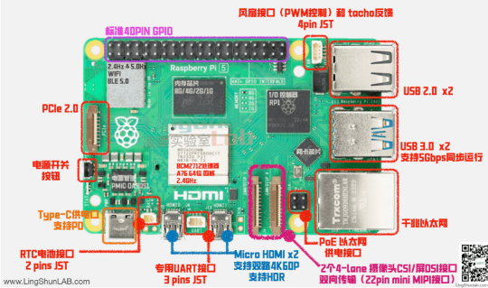
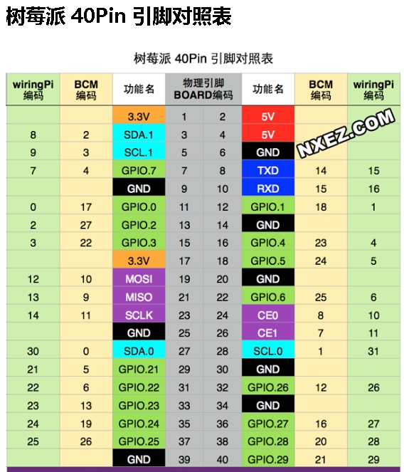

# 硬件部分

## 接口功能

## GPIO 40pin 定义

[树莓派5 40 针脚定义](./pi5_pin.md)

### 引脚编号

- 物理引脚编号（BOARD 模式）
物理引脚编号是按照引脚在电路板上的实际位置顺序编号，从 1 开始依次排列
- BCM 模式
BCM 模式的编号是根据芯片内部的 Broadcom 芯片的引脚功能来编号的.
BCM 模式提供了一定程度的硬件无关性。

### cam

[相机基本介绍](./cam.md)

## 元器件

[常用元器件](./parts.md)
