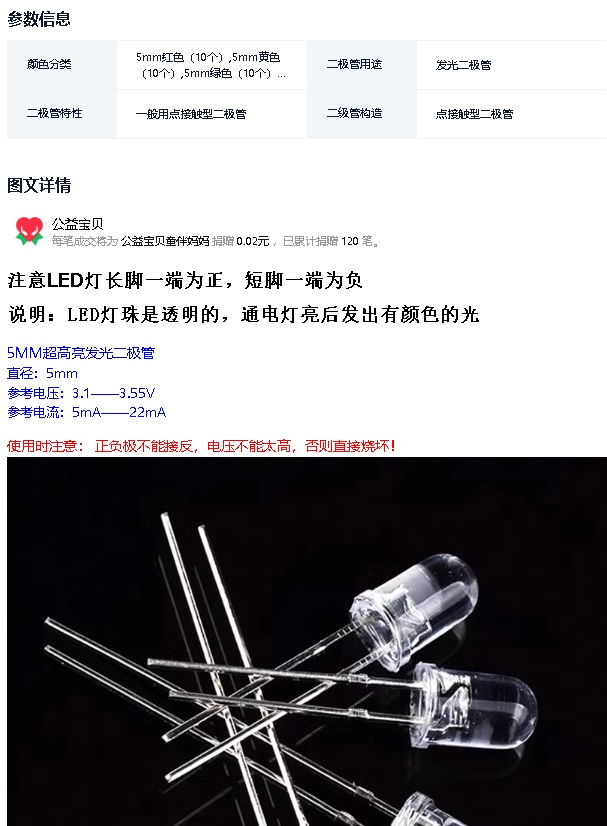
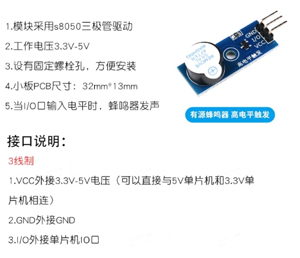
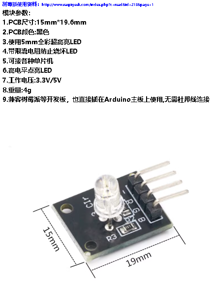
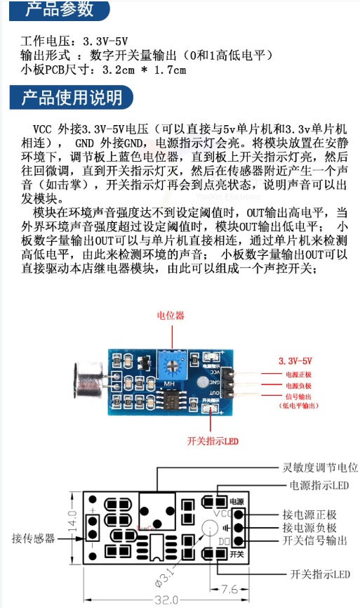
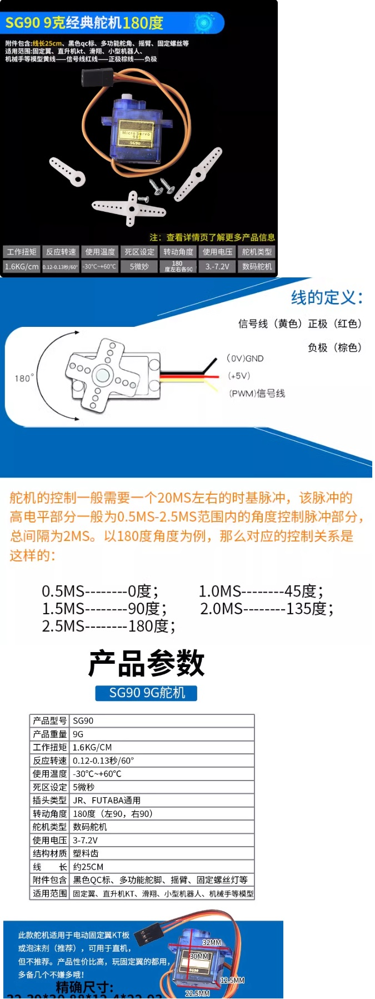
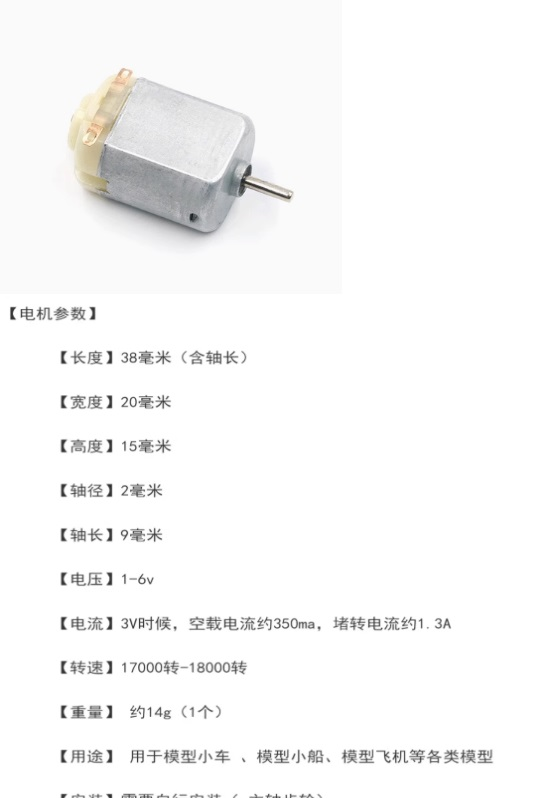
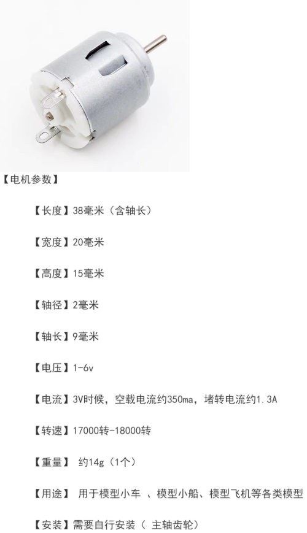
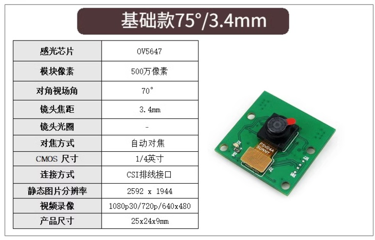

# 测试元器件

- [x] led 灯珠
  - 3.3v 电压输入
  - 长脚为正，短脚为地
  - 绿灯能够接受的电流小
  
- [x] 蜂鸣器模块
  
- [x] RGB全彩LED模块
  
- [x] 声音检测传感器
  
- [ ]SG90 9克舵机【旋转180°】
  
- [ ] 130马达
  
- [ ] 140马达
  
- [ ] csi接口Cam
  
- [ ] 激光模组 5mW 红色一字
